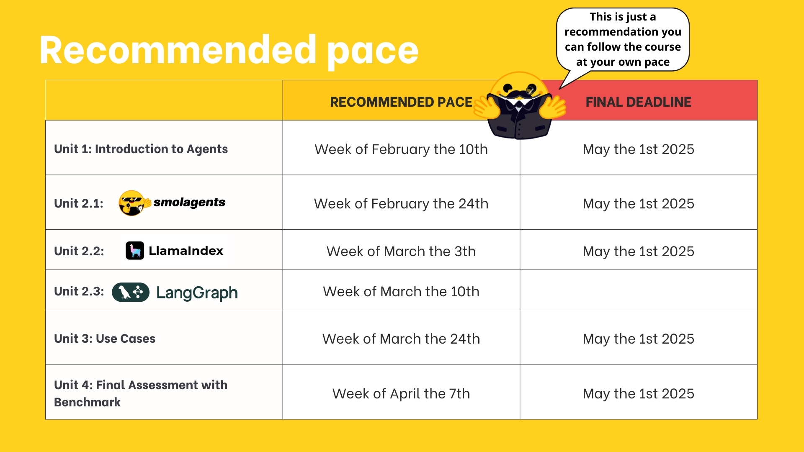

# AI Agents

This repo is based on [Official Hugging Face AI Agents Course](https://huggingface.co/learn/agents-course)

## Course Overview

In this course, you will:

- 📖 Study AI Agents in theory, design, and practice.
- 🧑‍💻 Learn to use **established AI Agent** libraries such as [smolagents](https://huggingface.co/docs/smolagents/en/index), [LangChain](https://www.langchain.com/), and [LlamaIndex](https://www.llamaindex.ai/).
- 💾 **Share your agents** on the Hugging Face Hub and explore agents created by the community.
- 🏆 Participate in challenges where you will **evaluate your agents against other students’.**
- **🎓 Earn a certificate of completion** by completing assignments.
And more!

At the end of this course you’ll understand **how Agents work and how to build your own Agents using the latest libraries and tools.**